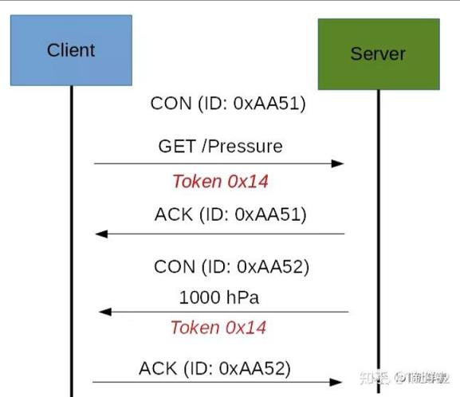
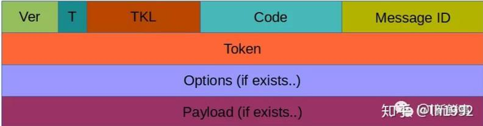

# 1.简介
CoAP 是一种 IoT 协议，具有专为受约束设备设计，类似MQTT
- CoAP 代表受限应用程序协议，它在RFC 7252中定义
- 用于 M2M 数据交换，并且与 HTTP 非常相似

CoAP 协议的主要功能:
- M2M 中使用的 Web 协议，要求有限
- 异步消息交换
- 低开销和非常简单的解析
- URI 和内容类型支持
- 代理和缓存功能

# 2.支持的消息类型
- Confirmable
- Non-confirmable
- Acknowledgment
- Reset

术语：
- Endpoint: 参与 CoAP 协议的实体。通常，终结点与主机一起标识
- Sender: 发送消息的实体
- Recipient: 发送消息的目标
- Client: 发送请求的实体和响应的目标
- Server: 从客户端接收请求并向客户端发送响应的实体

# 3.CoAP 消息模型
- CoAP 的最底层模型。此层处理 UDP 在终结点之间交换消息
- CoAP 消息由以下部分组成：
    - A binary header
    - A compact options 
    - Payload
- CoAP 协议使用两种消息，每个消息都有唯一的消息ID
    - Confirmable message：可靠
    - Non-confirmable message：不可靠
- 交换类型：
    - CON-ACK应答
    - CON-RST挂起
    - NCON
    
# 4.请求/响应模型
CoAP 请求/响应是 CoAP 抽象层中的第二层
- 请求使用可确认 （CON） 或不可确认 （NON） 消息发送
- Token 用于匹配请求和响应
- 有几种模式

  
# 5.CoAp 消息格式

- Ver：它是一个 2 位无符号整数，指示版本
- T：它是一个 2 位无符号整数，指示消息类型：0 可确认，1 个不可确认
- TKL：令牌长度是令牌 4 位长度
- Code：它是代码响应（8 位长度）
- 消息 ID：它是用 16 位表示的消息 ID

# 6.CoAP安全方面
- CoAP 依靠 UDP 安全方面来保护信息
  - 当 HTTP 在 TCP 上使用 TLS 时，CoAP在 UDP 上使用数据报 TLS
  - DTLS 支持 RSA、AES
  
# 7.CoAP 和 MQTT 之间的主要区别
- MQTT 使用发布者-订阅者，而 CoAP 使用请求-响应范例
- MQTT 使用中央代理将消息从发布者发送到客户端。CoAP 本质上是一对一协议，与 HTTP 协议非常相似
- MQTT 是面向事件的协议，而 CoAP 更适合状态传输

    
