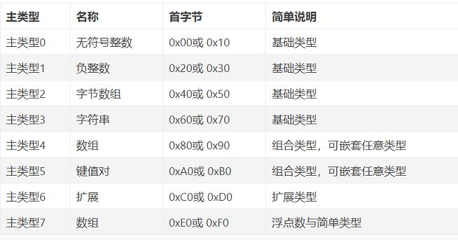

# 参考地址
cbortree：一个用于解码、操作和编码CBOR数据项的Java库
- https://github.com/google/cbortree

物联网专用数据交换格式CBOR
- https://www.jianshu.com/p/76adec5e61f8

# 1.Cbor概述
- CBOR是专门为受限制物联网终端设计的数据交换格式，可以简单理解为二进制形式JSON格式
- CBOR格式可以与COAP协议组合使用，犹如HTTP+JSON
- CBOR也是COSE的基础

# 2.Cbor主类型
- CBOR可分为8个主类型
- 首字节的高3位定义主类型。 首字节的低5位在不同的主类型表示长度,长度指示不足，则依次使用后续字节

  
# 3.无符号整数
- 主类型0，无符号整数编码后首字节为0b000_XXXXX
- 为表达不同长度的无符号整数，CBOR格式使用第一个字节的低5位表示整数类型
    - 0b000_11000 uint8_t
    - 0b000_11001 uint16_t
    - 0b000_11010 uint32_t
    - 0b000_11011 uint64_t
- 无符号整数0到23直接表达，无需使用整数类型

# 4.负整数
- 主类型1，无符号整数编码后首字节为0b001_XXXXX，编码方式与无符号整数相似

# 5.字节数组
- 主类型2，字节数组编码后首字节为0b010_XXXXX
- 为了表达字节数组长度，如果字符数组的长度小于等于23，那么直接使用首字节的低5位表示
- 如果长度大于或等于24字节，那么使用第二个字节表示长度；
- 如果长度大于等于256字节，那么使用第二和第三个字节表示长度

  
- CBOR格式中一般采用多字节组合的方式表达长度
- CBOR这样的长度描述方法便于嵌入式设备使用C语言解析CBOR格式，节约宝贵的栈空间与堆空间
- CBOR仅为这些原始的字节数组增加了一个长度描述

# 6.字符串
- 主类型3。字符串类型编码后首字节为0b011_XXXXX
- 字符串格式表达长度的方式与字节数组类型相似

# 7.数组
- 主类型4。 数组编码后首字节为0b100_XXXXX
- 数组中数组元素个数（不是编码后字节长度）的表达方式与字节数组类型相似。

# 8.键值对
- 主类型5。键值对编码后首字节为0b101_XXXXX
- 键值对也是一种符合类型，可以嵌套任意类型
- 键值对类型中键值对个数（不是编码后的字节长度）的表达方式与字节类型表达方式相似
- 在JSON类型中，键名Key必须为字符串，但是在CBOR格式中，键名Key可以是整数，CBOR通过这种方式可以节省物联网终端开销。

# 9.扩展类型
- 主类型6。扩展类型编码后首字节为0b110_XXXXX
- CBOR通过增加Tag的方式扩展类型，满足未来的扩展
- 在CBOR扩展类类型描述中，一般以Tag编号开头，然后在小括号中()保存内容，内容可以是任意一种CBOR类型

# 10.浮点数与简单类型
- 主类型7。浮点数与简单类型编码后首字节为0b111_XXXXX
- 该类型定义了简单类型，时间类型（Date和Time）、大整数（Bignum），10进制整数（Decimal）等
- 在主类型7中，首字节的高3位固定为0b111，首字节中低5位用于表示子类型

首字节的低5位中0到23表示简单类，定义如下：
- 20 表达False
- 21 表达True
- 22 表达Null
- 23 表达Undefined Value

所以：
- False 编码后 0xF4
- True 编码后 0xF5
- Null 编码后 0xF6

# 11.总结
- CBOR格式是一种带有明显长度指示的传输协议，而常用的JSON格式并没有长度指示。长度指示可以帮助终端设备在进行CBOR解析时节约宝贵的堆空间。
- CBOR格式支持键值对形式 Key-Value，Key可以是整数，而JSON格式中Key值只能是字符串。
- CBOR格式中Date、Time、Decimal类型解决了物联网终端设备中时间日期与十进制数表达的问题。