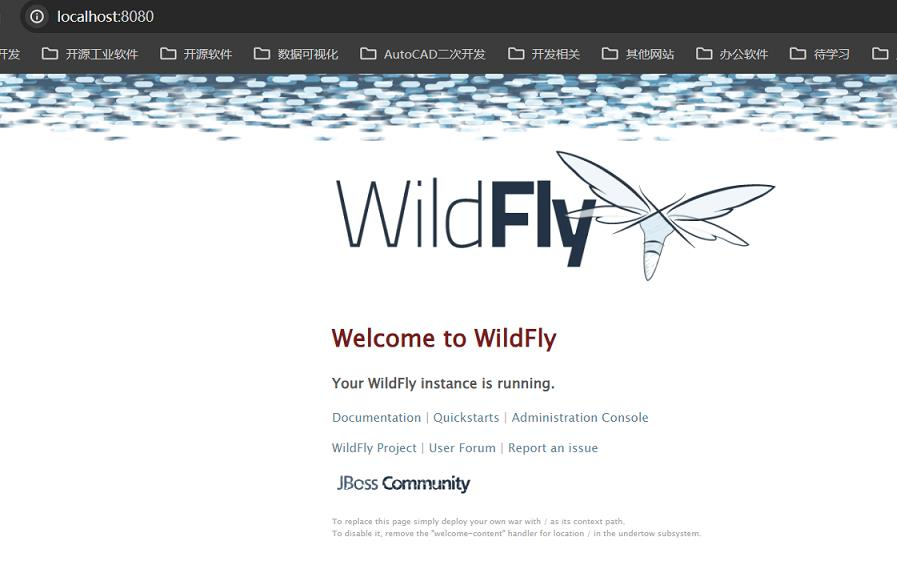

# 参考地址
wildfly部署springboot项目
- https://blog.csdn.net/shaoming314/article/details/123931795

一小时实践入门 WildFly
- https://zhuanlan.zhihu.com/p/641963555

# 简介
## WildFly 和 Tomcat
- WildFly 是一个完全的 Java EE 应用服务器，它支持 Java EE 的所有规范，重量级
- Apache Tomcat 是一个 Web 应用服务器，主要用于运行基于 Java 的 web 应用，轻量级

## 打包war包
- 配置如本项目

## 下载WildFly
- https://www.wildfly.org/downloads/
    - 24.0.0.Final——Jakarta EE 8 Full & Web Distribution
    
## 配置外网访问
- /standalone/configuration/standalone.xml
```
  <interfaces>
        <interface name="management">
            <inet-address value="${jboss.bind.address.management:127.0.0.1}"/>
        </interface>
        <interface name="public">
            <!-- 修改 127.0.0.1 为 0.0.0.0 可以外网访问 -->
            <inet-address value="${jboss.bind.address:0.0.0.0}"/>
        </interface>
    </interfaces>
```

## 上传war包
- /standalone/deployments/ 路径下

## 启动
- /bin/standalone.bat
- 访问：

  
- http://localhost:8080/test665
