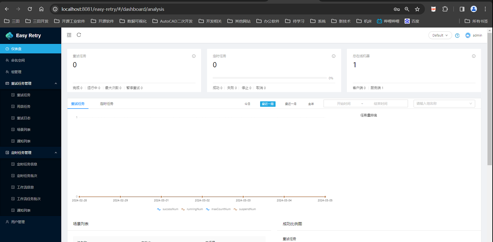

# 参考地址
easy-retry 灵活，可靠和快速的分布式任务重试和分布式任务调度平台
- https://gitee.com/aizuda/easy-retry
  
官方文档
- https://www.easyretry.com/

# 1.服务端部署
1. 下载源码：`git clone git@gitee.com:aizuda/easy-retry.git`
2. 修改服务端配置
3. 运行sql文件  doc/sql/easy_retry_mysql.sql
4. 运行：easy-retry-server/easy-retry-server-starter/EasyRetryServerApplication
5. 访问localhost:8080/easy-retry
6. 登录默认用户：admin/admin

页面如下：


# 2.配置
## 2.1 客户端配置
```yml
easy-retry:
  server:
    # 服务端的地址，若服务端集群部署则此处配置域名
    host: 127.0.0.1
    # 服务端netty的端口号
    port: 1788
  # 指定客户端IP，不配置则取本地IP
  host: 127.0.0.1
  # 指定客户端端口，不配置则取取本地端口
  port: 8080 
  # 名称空间ID， 若不填为默认空间(764d604ec6fc45f68cd92514c40e9e1a)
  namespace: 764d604ec6fc45f68cd92514c40e9e1a
  # 批量上报滑动窗口配置
  slidingWindow:
    # 窗口期单位
    chrono-unit: seconds
    # 窗口期时间长度
    duration: 10
    # 总量窗口期阈值
    total-threshold: 50
    # 窗口数量预警
    window-total-threshold: 150 
```
## 2.2 服务端配置
```yml
easy-retry:
  # 拉取重试数据的天数
  last-days: 30
  # 拉取重试数据的每批次的大小
  retry-pull-page-size: 100
  # 服务端netty端口
  netty-port: 1788
  # 重试和死信表的分区总数
  total-partition: 2
  # 一个客户端每秒最多接收的重试数量指令
  limiter: 10
  # 号段模式下步长
  step: 100
  # 日志保存时间(单位: day)
  log-storage: 90
  #当前使用的数据库
  db-type: mysql
  # 负载均衡周期时间
  load-balance-cycle-time: 10
  # bucket的总数量    
  bucket-total: 128
  # 系统模式
  mode: all
  # 最大拉取次数
  retry-max-pull-count: 10
  # Dashboard 任务容错天数
  summary-day: 7
  # 回调配置
  callback:
    # 回调uniqueId前缀
    prefix: CB
    # 回调最大执行次数
    max-count: 288
    # 间隔时间
    trigger-interval: 900 

```

# 3.客户端
## 3.1 重试
- @Retryable注解：重试相关设置
- `@Retryable(scene = "remoteRetry",retryStrategy = RetryType.ONLY_REMOTE)`：服务端上报
- `@Retryable(scene = "localRetryIncludeException",include = ParamException.class)`：指定异常
- IdempotentIdGenerate：幂等id生成接口
- RetryCompleteCallback：回调函数
- Callback：回调方法
- retryMethod：重试方法
- bizNo：标记业务号

spi扩展点：
- EasyRetryListener
- RetryArgSerializer：参数序列
- RetrySiteSnapshotContext：重试现场记录器
- ExpressionEngine：表达式解析器

通知：超过设置的阈值会进行通知

## 3.2 Job模块
- JobExecutor注解