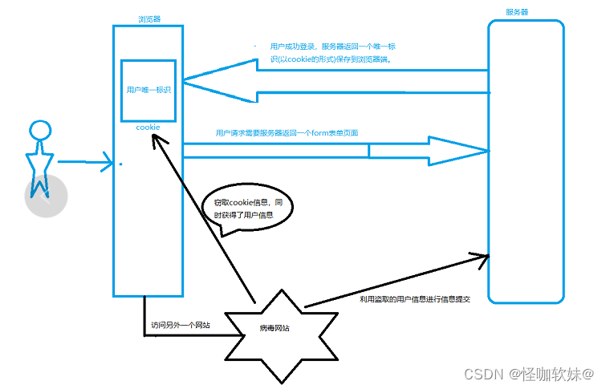

# 参考地址
SpringBoot 如何防御 CSRF 攻击
- https://blog.csdn.net/leveretz/article/details/128476049

SpringBoot+SpringSecurity+Thymeleaf 演示CSRF攻击
- https://blog.csdn.net/weixin_43888891/article/details/125155358

# CSRF概述
跨站请求伪造，也被称为 one-click attack 或者 session riding，通常缩写为 CSRF 或者 XSRF， 
是一种挟制用户在当前已登录的 Web 应用程序上执行非本意的操作的攻击方法。
跟跨网站脚本（XSS）相比，XSS利用的是用户对指定网站的信任，CSRF 利用的是网站对用户网页浏览器的信任。

跨站请求攻击，简单地说，是攻击者通过一些技术手段欺骗用户的浏览器去访问一个自己曾经认证过的网站并运行一些操作（如发邮件，发消息，甚至财产操作如转账和购买商品）。
由于浏览器曾经认证过，所以被访问的网站会认为是真正的用户操作而去运行。
这利用了 web 中用户身份验证的一个漏洞：简单的身份验证只能保证请求发自某个用户的浏览器，却不能保证请求本身是用户自愿发出的。

Spring Security 4.0 开始，默认情况下会启用 CSRF 保护，以防止 CSRF 攻击应用程序，Spring Security CSRF 会针对 PATCH，POST，PUT 和 DELETE 方法进行防护。



# 如何防护
1. updateUser.html添加
```
<input type="hidden" th:name="${_csrf.parameterName}" th:value="${_csrf.token}"/>
```
2. updateSuccess.html添加
```
<span th:text="${_csrf.token}"></span>
```
3. 开启CSRF防护
```
//http.csrf().disable();
```