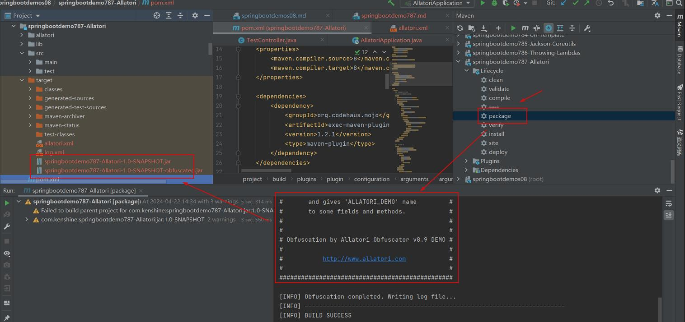

# 参考地址
官网
- https://allatori.com/

Spring Boot项目使用Allatori代码混淆技术
- https://github.com/Lovnx/confusion

allatori-JAVA代码混淆工具
- https://blog.csdn.net/xuyw10000/article/details/131560633

# Allatori概述
Allatori是一个Java 混淆器，它属于第二代混淆器，具有以下几种保护方式
- 命名混淆，流混淆，调试信息混淆，字符串混淆，以及水印技术
- 支持jar与war格式的混淆，允许对需要混淆代码的应用程序添加有效日期

执行maven package进行混淆，混淆成功如下：

