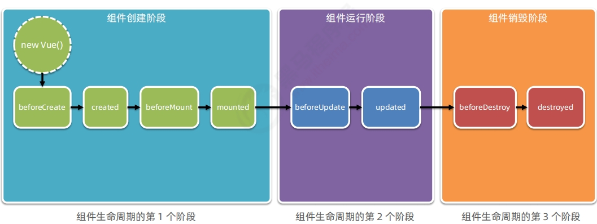

# 1.webpack

vue-cli中会自动配置webpack，了解即可

## 1.1 基础

1. 安装webpack

   ```
   npm install webpack@5.42.1 webpack-cli@4.9.0 -D
   ```

2. webpack配置：执行`webpack`命令会生成`main.js`文件

   ```
   //使用Node.js中的导出语法,向外导出一个webpack的配置对象
   module.exports = {
       //运行模式 development production(压缩) 
       mode: 'development'
   }
   ```

3. entry：打包入口，output：打包出口

4. 插件：配置在`webpack.config.js`

   - `npm install webpack-dev-server@3.11.2 -D`：修改源代码时自动打包
     - `devServer`节点可以对`webpack-dev-server`进行更多配置
   - `npm i -D html-webpack-plugin@5.3.2`：可自定义 index.html 内容
     - 复制`index.html`页面，自动注入打包的js文件

## 1.2 Loader 加载器

webpack只能默认打包处理`.js`结尾的模块，其他文件需要调用`loader加载器`才能正常打包

- `css-loader`：打包处理`.css`相关的文件，需要在`webpack` rules中配置
  - `npm i style-loader@3.0.0 css-loader@5.2.6 -D`
- `less-loader`：打包处理`.less`相关的文件
  - `npm i less-loader@10.0.1 less@4.1.1 -D`
- `url-loader`：打包与url路径相关的文件
  - `npm i url-loader@4.1.1 file-loader@6.2.0 -D`
- `babel-loader`：打包处理 `webpack` 无法处理的高级js语法
  - `npm i babel-loader@8.2.2 @babel/core@7.14.6 @babel/plugin-proposal-decorators@7.14.5 -D`
  - 需要添加`babel.config.js`进行配置

## 1.3 发布

1. package.json下新建bulid脚本
2. `clean-webpack-plugin`：自动清理掉 dist 目录中的旧文件
   - `npmjs.com`中搜索插件安装

## 1.4 SourceMap

1. 存储着源代码位置信息，打包后也能看见

   ```
   module.exports = {
       //开发调试阶段使用
       devtool: 'eval-source-map',
       ...
   }
   ```

2. 生产环境下，如果只想定位报错的具体行数，且不想暴露源码：`nosources-source-map`

3. 生产环境下，定位报错行数的同时，展示具体报错的源码：`source-map`

# 2.Vue简介及基本使用

## 2.1 简介

1. 一套用于构建用户界面的前端框架

   - ① 数据驱动视图
   - ② 双向数据绑定

2. MVVM：vue 实现数据驱动视图和双向数据绑定的核心原理

   - Model 表示当前页面渲染时所依赖的数据源。

   - View 表示当前页面所渲染的 DOM 结构。

   - ViewModel 表示 vue 的实例，它是 MVVM 的核心

## 2.2 基本使用

1. Vue基本使用：

   - 导入 vue.js 的 script 脚本文件

   - 在页面中声明一个将要被 vue 所控制的 DOM 区域

   - 创建 vm 实例对象（vue 实例对象）

## 2.3 Vue指令

指令（Directives）是 vue 为开发者提供的模板语法，用于辅助开发者渲染页面的基本结构。

#### 1. 内容渲染指令

1. `v-text` 指令的缺点：会覆盖元素内部原有的内容！
2. `{{ }}` 插值表达式：在实际开发中用的最多，只是内容的占位符，不会覆盖原有的内容！
   - 除了支持绑定简单的数据值之外，还支持 Javascript 表达式的运算
3. `v-html` 指令的作用：可以把带有标签的字符串，渲染成真正的 HTML 内容！


#### 2. 属性绑定指令

>  注意：插值表达式只能用在元素的**内容节点**中，不能用在元素的**属性节点**中！

+ 在 vue 中，可以使用 `v-bind:` 指令，为元素的属性动态绑定值；

+ 简写是英文的 `:`

+ 在使用 v-bind 属性绑定期间，如果绑定内容需要进行动态拼接，则字符串的外面应该包裹单引号，例如：

  ```xml
  <div :title="'box' + index">这是一个 div</div>
  ```


#### 3. 事件绑定

1. `v-on:` 简写是 `@`

2. 语法格式为：

   ```
   <button @click="add"></button>
   methods: {
      add() {
   		// 如果在方法中要修改 data 中的数据，可以通过 this 访问到
   		this.count += 1
      }
   }
   ```

3. `$event` 的应用场景：如果默认的事件对象 e 被覆盖了，则可以手动传递一个  $event。例如：

   ```
   <button @click="add(3, $event)"></button>
   methods: {
      add(n, e) {
   			// 如果在方法中要修改 data 中的数据，可以通过 this 访问到
   			this.count += 1
      }
   }
   ```

4. 事件修饰符：

   + `.prevent`：阻止默认行为（例如：阻止 a 连接的跳转、阻止表单的提交等）

     ```
     <a @click.prevent="xxx">链接</a>
     ```

   + `.stop`：阻止事件冒泡

     ```
     <button @click.stop="xxx">按钮</button>
     ```

   + `.capture `：以捕获模式触发当前的事件处理函数
   
   + `.once `：绑定的事件只触发1次
   
   + `.self`：只有在 `event.target` 是当前元素自身时触发事件处理函数
   
5. 按键修饰符：`@keyup.esc="clearInput"`在案esc键时触发方法

#### 4. v-model 双向绑定指令

1. input 输入框
   + type="radio"
   + type="checkbox"
   + type="xxxx"
2. textarea
3. select
4. 修饰符：
   - `.number`：自动将用户的输入值转为数值类型
   - `.trim`：自动过滤用户输入的首尾空白字符
   - `.lazy `：在“change”时而非“input”时更新


#### 5. 条件渲染指令

`v-if`与`v-for`：

1. `v-show` 的原理是：动态为元素添加或移除 `display: none` 样式，来实现元素的显示和隐藏
   + 如果要频繁的切换元素的显示状态，用 v-show 性能会更好
2. `v-if` 的原理是：每次动态创建或移除元素，实现元素的显示和隐藏
   + 如果刚进入页面的时候，某些元素默认不需要被展示，而且后期这个元素很可能也不需要被展示出来，此时 v-if 性能更好

>  在实际开发中，绝大多数情况，不用考虑性能问题，直接使用 v-if 就好了！！！

v-if 指令在使用的时候，有两种方式：

1. 直接给定一个布尔值 true 或 false

   ```xml
   <p v-if="true">被 v-if 控制的元素</p>
   ```

2. 给 v-if 提供一个判断条件，根据判断的结果是 true 或 false，来控制元素的显示和隐藏

   ```xml
   <p v-if="type === 'A'">良好</p>
   ```

其他指令：`v-else`，`v-else-if`


#### 6.列表渲染指令

- vue 提供了`v-for`列表渲染指令，用来辅助开发者基于一个数组来循环渲染一个列表结构
- v-for 指令需要使用 `item in items` 形式的特殊语法：
  - items 是待循环的数组
  - item 是被循环的每一项
- v-for 中的索引：可选的第二个参数
  - 语法格式为 ：`(item, index) in items`
- 建议使用`v-for`时加上key属性，既提升性能、又防止列表状态紊乱

## 2.4 过滤器

- 过滤器（Filters）是 vue 为开发者提供的功能，常用于文本的格式化，可以在插值和`v-bind`中使用
- Vue3.0 中移除了过滤器
- 过滤器定义：
  - **私有过滤器**：在 filters 节点下定义的过滤器，只能在当前 vm 实例所控制的 el 区域内使用
  - **全局过滤器**：`Vue.filter(..)`
- 使用：`{{message|filter1|filter2...}}`

## 2.5 watch侦听器

1. watch 侦听器允许开发者监视数据的变化，从而针对数据的变化做特定的操作
2. `immediate`选项：控制侦听器是否自动触发一次(`watch`侦听器立即被调用)
3. `deep`选项：`watch`侦听的是一个对象，对象中的属性值发生了变化则需要设置该选项
   - 监听对象单个属性的变化：参考`day3/code/05.深度侦听`

## 2.6 Compute计算属性

1. 计算属性指的是通过一系列运算之后，最终得到一个属性值，可以被模板结构或`methods`方法使用
2. 计算属性的特点：
   - 计算属性的本质是一个属性
   - 计算属性会缓存计算的结果，只有计算属性依赖的数据变化时，才会重新进行运算

## 2.7 Axios

- 最火的http库，
- 详见：`day3/code/08~10`
- 默认返回的是promise，用`.then`来获取数据，`result.data`
  - `await axios...`：只能用于`async`修饰的方法，直接获取到data（ES8）

# 3.Vue组件

## 3.1 vue-cli

1. vue-cli是 Vue.js 开发脚手架。它简化了程序员基于`webpack`创建工程化的Vue项目的过程
2. 安装：`npm install -g @vue/cli`
   - 升级：先卸载`npm uninstall -g vue-cli`后安装
3. 创建工程化项目：`vue create 项目的名称`（vue-cli3后的功能，vue-cli版本与vue版本无关）
   - 创建时建议选第三项`Manually xxxx`，可定制性更高
   - `vue ui`：可视化创建
4. vue 项目中 src 目录的构成：
   - `assets`文件夹：存放项目中用到的静态资源文件，例如：css 样式表、图片资源
   - `components`文件夹：程序员封装的、可复用的组件，都要放到 components 目录下
   - `main.js`是项目的入口文件。整个项目的运行，要先执行 `main.js`
   - `App.vue`是项目的根组件

## 3.2 组件的使用

1. 组件化开发：

   - 根据封装的思想，把页面上可重用的UI结构封装为组件，从而方便项目的开发和维护

2. vue 中规定：组件的后缀名是`.vue`

3. 组成：

   - **template**：组件的模板结构（必选）
     - 每个组件对应的模板结构，需要定义到 `<template>`节点中
     - 只起到包裹性质的作用，它不会被渲染为真正的 DOM 元素
     - `template`中只能包含唯一的根节点
   - **script**：组件的JavaScript行为（可选）
     - `.vue` 组件中的`data`必须是一个函数，不能直接指向一个数据对象
   - **style**：组件的样式（可选）

4. 组件之间的父子关系：

   - 组件在被封装好之后，彼此之间是相互独立的，不存在父子关系
   - 在使用组件的时候，根据彼此的嵌套关系，形成了父子关系、兄弟关系

5. 使用组件的三个步骤：

   1. 使用`import`语法导入需要的组件
   2. 使用`components`节点注册组件
      - `components`注册私有子组件
      - `Vue.component()`方法注册全局组件
   3. 以标签形式使用刚才注册的组件

6. 路径提示插件：`Path AutoComplete`

   ```json
   	//settings.json下添加该配置
   	"path-autocomplete.pathMappings":{
           "@/":"${folder}/src/"
       },
       "path-autocomplete.extensionOnImport":true,
   ```

7. 标签自动闭合插件：`Auto Close Tag`

## 3.3 props

1. `props`是组件的**自定义属性**，可以避免与其他组件定义的属性冲突
2. `props`是只读的，程序员不能直接修改props的值
3. `default`：默认值
4. `type`：属性的值类型
5. `required`：将属性设置为必填项
6. 可用于组件之间传值

## 3.4 组件样式冲突

- 写在`.vue`组件中的样式会全局生效，因此很容易造成多个组件之间的样式冲突问题。
- vue为style节点提供了`scoped`属性，防止组件之间的样式冲突问题
- `/deep/ 深度选择器`：想让某些样式对子组件生效 （参考`day4/demo-1`）

## 3.5 组件的生命周期

1. 组件的生命周期函数：按顺序

   

2. [更详细图示](https://cn.vuejs.org/v2/guide/instance.html#%E7%94%9F%E5%91%BD%E5%91%A8%E6%9C%9F%E5%9B%BE%E7%A4%BA)

## 3.6 组件之间数据共享

1. 父组件向子组件共享数据使用**自定义属性 props**

2. 子组件向父组件共享数据使用**自定义事件 this.$emit**

3. 在vue2.x中，兄弟组件之间数据共享的方案是 **EventBus**

   - 创建`eventBus.js`模块，并向外共享一个 Vue 的实例对象

   - `bus.$emit`：发送
   - `bus.$on`：绑定事件并接收

## 3.7 ref 引用

1. ref用来辅助开发者在不依赖于 jQuery 的情况下，获取 DOM 元素或组件的引用
2. 每个vue的组件实例上，都包含一个`$refs`对象，里面存储着对应的 DOM 元素或组件的引用。默认情况下，组件的`$refs`指向一个空对象
3. 引用DOM：在对应DOM元素添加 ref 属性值
4. 引用组件实例：在组件标签添加 ref 属性值
5. `this.$nextTick(cb)`：组件的 DOM 更新完成之后，再执行 cb 回调函数。从而能保证 cb 回调函数可以操作到最新的 DOM 元素
6. 示例：`day5/demo-1`

